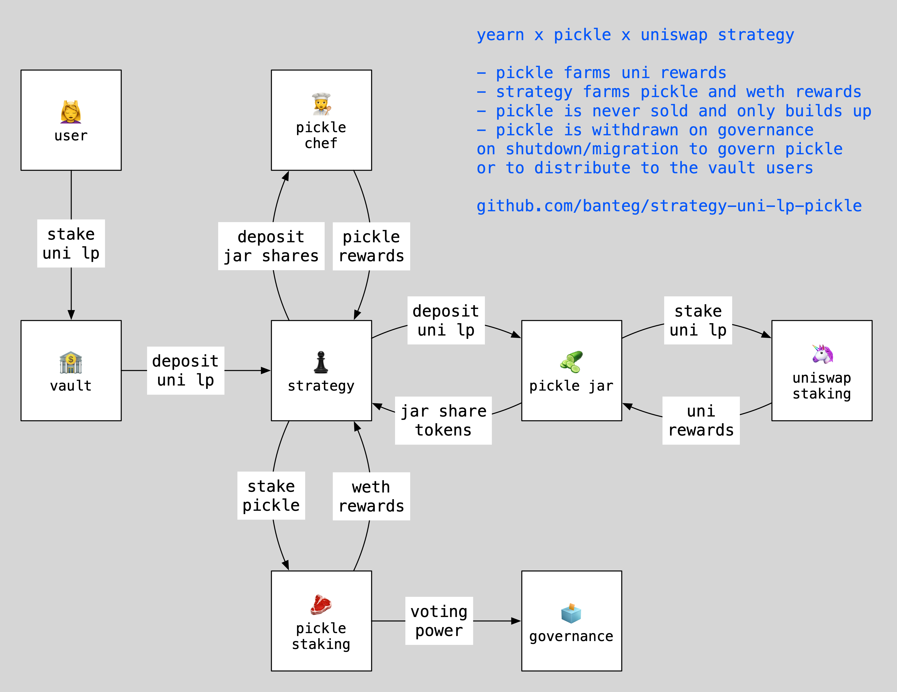

# StrategyUniswapPairPickle



## Abstract

1. A user deposits Uniswap v2 LP (`want`) token into the Vault.
2. Strategy deposits these LP tokens into Pickle Jar.
3. Pickle Jar deposits them into Uniswap Staking, earning UNI rewards.
4. The rewards are recycled into more `want` on Pickle's side, increasing Jar/LP ratio.
5. Pickle Jar shares are deposited into Pickle Far, earning PICKLE rewards.
6. Earned PICKLE rewards are deposite into Pickle Staking, earning WETH rewards.
7. Earned WETH rewards are sold for LP components and combined into more `want`.
8. On event of shutdown or migration, all accumulated PICKLE is sent to `governance`.


## Supported configurations

1. Uniswap v2 USDT-WETH Pool
2. Uniswap v2 USDC-WETH Pool
3. Uniswap v2 DAI-WETH Pool
4. Uniswap v2 WBTC-WETH Pool

## Deploy

```
brownie run deploy
```

## Tests

```
brownie test -s
```
